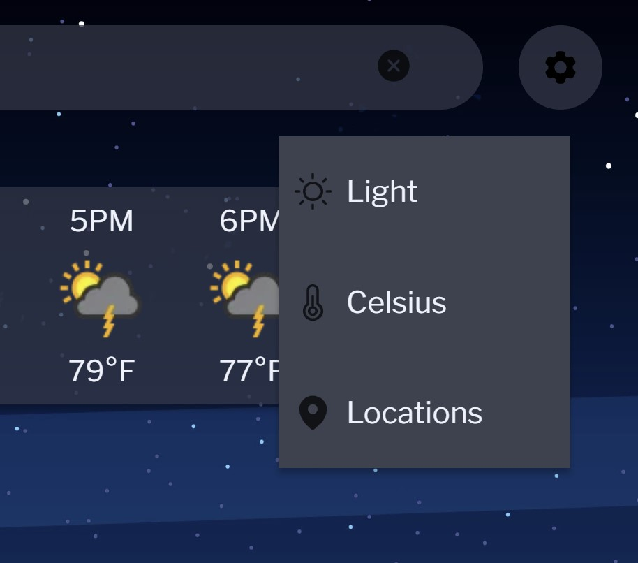

<!-- Improved compatibility of back to top link: See: https://github.com/othneildrew/Best-README-Template/pull/73 -->

<a name="readme-top"></a>

<!--
*** Thanks for checking out the Best-README-Template. If you have a suggestion
*** that would make this better, please fork the repo and create a pull request
*** or simply open an issue with the tag "enhancement".
*** Don't forget to give the project a star!
*** Thanks again! Now go create something AMAZING! :D
-->

<!-- PROJECT SHIELDS -->
<!--
*** I'm using markdown "reference style" links for readability.
*** Reference links are enclosed in brackets [ ] instead of parentheses ( ).
*** See the bottom of this document for the declaration of the reference variables
*** for contributors-url, forks-url, etc. This is an optional, concise syntax you may use.
*** https://www.markdownguide.org/basic-syntax/#reference-style-links
-->

[![Contributors][contributors-shield]][contributors-url]
[![Forks][forks-shield]][forks-url]
[![Stargazers][stars-shield]][stars-url]
[![Issues][issues-shield]][issues-url]
[![MIT License][license-shield]][license-url]
[![LinkedIn][linkedin-shield]][linkedin-url]

<!-- PROJECT LOGO -->
<br />
<div align="center">
  <a href="https://github.com/jbrace817/WeatherApp">
    
  </a>

<h3 align="center">WeatherApp</h3>

  <p align="center">
    Realtime Weather App
    <br />
    <a href="https://github.com/jbrace817/WeatherApp">View Demo</a>
    ·
    <a href="https://github.com/jbrace817/WeatherApp/issues/new/choose">Report Bug</a>
    ·
    <a href="https://github.com/jbrace817/WeatherApp/issues/new/choose">Request Feature</a>
  </p>
</div>

<!-- TABLE OF CONTENTS -->
<details>
  <summary>Table of Contents</summary>
  <ol>
    <li>
      <a href="#about-the-project">About The Project</a>
      <ul>
        <li><a href="#built-with">Built With</a></li>
        <li><a href="#description">Description</a></li>
      </ul>
    </li>
    <li>
      <a href="#getting-started">Getting Started</a>
      <ul>
        <li><a href="#prerequisites">Prerequisites</a></li>
        <li><a href="#installation">Installation</a></li>
      </ul>
    </li>
    <li><a href="#usage">Usage</a></li>
    <li><a href="#contributing">Contributing</a></li>
    <li><a href="#license">License</a></li>
    <li><a href="#contact">Contact</a></li>
  </ol>
</details>

<!-- ABOUT THE PROJECT -->

## About The Project

[![Weather App Screen Shot][weatherApp-screenshot]]()

<p align="right">(<a href="#readme-top">back to top</a>)</p>

### Built With

- [![JavaScript][JavaScript]][JavaScript-url]

<p align="right">(<a href="#readme-top">back to top</a>)</p>

### Description

I created this personal project to help me get a better understanding on how to work with API's and web components. The API I used is a free tier provided by [www.weatherapi.com](https://www.weatherapi.com/). If you are interested in learning about web components, I found a great resource at [javascript.info](https://javascript.info/web-components). Eslint-config-airbnb-base and Prettier are used to format the code. Date-fns-tz version 2.0.1 was needed for converting time from zoned time to UTC.

<p align="right">(<a href="#readme-top">back to top</a>)</p>

<!-- GETTING STARTED -->

## Getting Started

If you don't already have git, Node.js with npm installed, please see the prerequisites as I have provided links to where you can download their installers.

### Prerequisites

Below are the links to the installers needed to run this project successfully:
<br>

- [Git](https://git-scm.com/downloads)
- [Node.js with npm](https://nodejs.org/en/download/) (Be sure to install the version labeled LTS)

To check and see if you already have Git installed, open a terminal window and try the following command.

```sh
git --version
```

To check and see if you already have node and npm installed, open a terminal window and try the following commands.

```sh
node -v
npm -v
```

### Installation

1. Get a free API Key at [weatherapi.com](https://www.weatherapi.com/). Here is the link to the their [documentation](https://www.weatherapi.com/docs/)
2. Create a local directory where you would like save the cloned directory.
3. Open Git Bash and change the location to the location where you would like the cloned directory.

4. Clone the repo
   ```sh
   git clone https://github.com/jbrace817/WeatherApp.git
   ```
5. Install NPM packages
   ```sh
   npm install
   ```
6. Enter your API key to `config.js`
   ```js
   const API_KEY = 'ENTER YOUR API';
   ```
7. Script to start the project in the developer environment.
   ```sh
   npm start
   ```
8. Script to bundle the project using webpack.
   ```sh
   npm run build
   ```

<p align="right">(<a href="#readme-top">back to top</a>)</p>

<!-- USAGE EXAMPLES -->

## Usage

When the application is loaded for the first time, it will prompt the user if it can use their location. If the user agrees, the application will utilize the Geolocation API to retrieve the user's current position. If declined, the application will load data for New York City.

The search bar at the top of the screen allows the user to search locations using the autocomplete API provided by weatherapi.com. This enables users to look up locations by city name, zip code, latitude, and longitude. A dropdown will appear, allowing users to navigate the list to find their desired location.

The gear icon in the upper right of the application reveals the settings menu, where users can toggle the theme of the application and the temperature scale. There is also a menu option labeled "Locations," which permits users to save desired locations to the browser's local storage.

<p align="center">

</p>

When the menu is opened, it will automatically populate the location from the main application and allow the user to save that location unless it's already in the list of saved locations. If a user chooses to search for a location, autocomplete is available in this menu's input field. Users can favorite a single location by clicking the star icon, which will then load at the time of click and when the user returns to the application at a later point in time. If a user wishes to see data for other saved locations, they may do so by clicking the desired location in the menu. If a user's browser cache and cookies are cleared, all saved locations will be removed from the browser's local storage.

<p align="center">

</p>

<p align="right">(<a href="#readme-top">back to top</a>)</p>

<!-- CONTRIBUTING -->

## Contributing

Contributions are what make the open source community such an amazing place to learn, inspire, and create. Any contributions you make are **greatly appreciated**.

If you have a suggestion that would make this better, please fork the repo and create a pull request. You can also simply open an issue with the tag "enhancement".
Don't forget to give the project a star! Thanks again!

1. Fork the Project
2. Create your Feature Branch (`git checkout -b feature/AmazingFeature`)
3. Commit your Changes (`git commit -m 'Add some AmazingFeature'`)
4. Push to the Branch (`git push origin feature/AmazingFeature`)
5. Open a Pull Request

<p align="right">(<a href="#readme-top">back to top</a>)</p>

<!-- LICENSE -->

## License

Distributed under the MIT License. See `LICENSE.txt` for more information.

<p align="right">(<a href="#readme-top">back to top</a>)</p>

<!-- CONTACT -->

## Contact

Project Link: [https://jbrace817.github.io/WeatherApp/](https://jbrace817.github.io/WeatherApp/)

<p align="right">(<a href="#readme-top">back to top</a>)</p>

<!-- MARKDOWN LINKS & IMAGES -->
<!-- https://www.markdownguide.org/basic-syntax/#reference-style-links -->

[contributors-shield]: https://img.shields.io/github/contributors/jbrace817/WeatherApp.svg?style=for-the-badge
[contributors-url]: https://github.com/jbrace817/WeatherApp/graphs/contributors
[forks-shield]: https://img.shields.io/github/forks/jbrace817/WeatherApp.svg?style=for-the-badge
[forks-url]: https://github.com/jbrace817/WeatherApp/network/members
[stars-shield]: https://img.shields.io/github/stars/jbrace817/WeatherApp.svg?style=for-the-badge
[stars-url]: https://github.com/jbrace817/WeatherApp/stargazers
[issues-shield]: https://img.shields.io/github/issues/jbrace817/WeatherApp.svg?style=for-the-badge
[issues-url]: https://github.com/jbrace817/WeatherApp/issues
[license-shield]: https://img.shields.io/github/license/jbrace817/WeatherApp.svg?style=for-the-badge
[license-url]: https://github.com/jbrace817/WeatherApp/blob/master/LICENSE.txt
[linkedin-shield]: https://img.shields.io/badge/-LinkedIn-black.svg?style=for-the-badge&logo=linkedin&colorB=555
[linkedin-url]: https://linkedin.com/in/jamesfbrace
[weatherApp-screenshot]: src/images/App_screenshot.jpg
[JavaScript]: https://shields.io/badge/JavaScript-F7DF1E?logo=JavaScript&logoColor=000&style=flat-square
[JavaScript-url]: https://developer.mozilla.org/en-US/docs/Web/JavaScript
